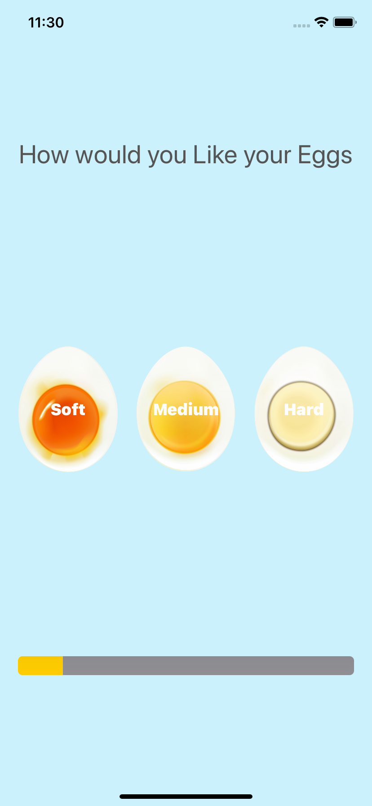
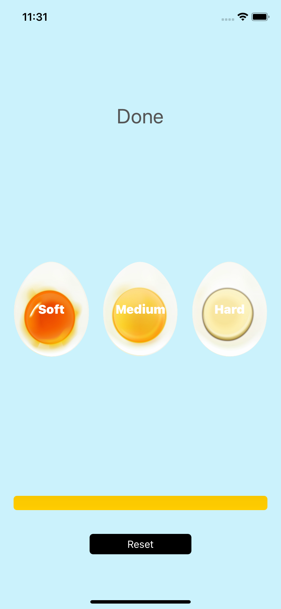

# Egg Timer

 a beautiful egg timer app to boil your eggs to perfection depending on how you prefer your eggs.

##Topics Of Learning Involved

* Swift Collection types - Dictionaries
* The Swift Timer API
* Conditional statements - IF/ELSE
* Conditional statements - Switch
* Functions with outputs
* How to use the ProgressView

## Screenshots

 || 
